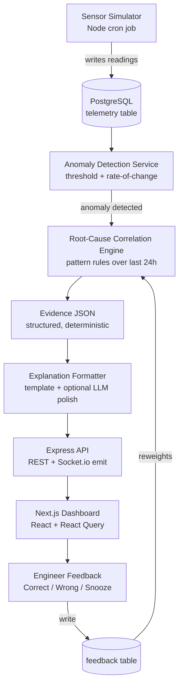
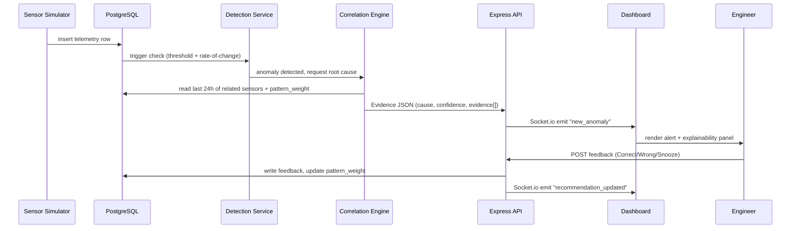
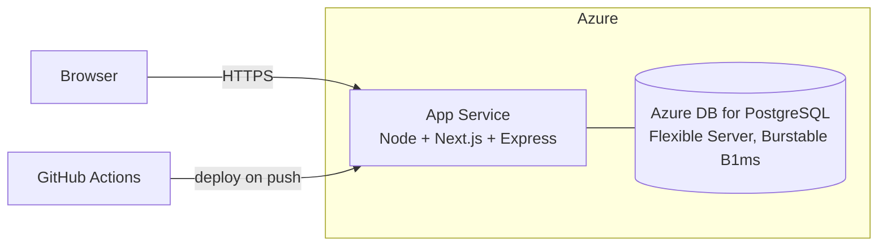

# ForgeLens — Architecture Document

Companion to [README.md](./README.md). This document covers **how** the system is built: the tech stack with rationale, the anomaly-detection and root-cause pipeline in detail, deployment topology, cost, and the key architecture decisions with their tradeoffs.

---

## Table of Contents

- [1. Architecture Principles](#1-architecture-principles)
- [2. Tech Stack (Detailed)](#2-tech-stack-detailed)
- [3. System Architecture](#3-system-architecture)
- [4. Component Breakdown](#4-component-breakdown)
- [5. How Anomaly Detection Actually Works](#5-how-anomaly-detection-actually-works)
- [6. Root-Cause Correlation Engine](#6-root-cause-correlation-engine)
- [7. Request/Data Flow (Sequence)](#7-requestdata-flow-sequence)
- [8. Deployment Architecture (Azure)](#8-deployment-architecture-azure)
- [9. Cost Breakdown](#9-cost-breakdown)
- [10. Scalability & Production Considerations](#10-scalability--production-considerations)
- [11. Security Considerations](#11-security-considerations)
- [12. Architecture Decision Records](#12-architecture-decision-records)

---

## 1. Architecture Principles

1. **Deterministic core, generative edge.** Every number the user sees (confidence, evidence weight, ETA-to-failure) comes from a rule that can be pointed to in code. An LLM, if used at all, only rephrases an already-computed result into prose — it never computes the result.
2. **Evidence is a first-class object, not a side effect.** The correlation engine doesn't just output "likely cause: valve degradation" — it outputs a structured evidence list that the UI renders directly. This is what makes the "Why do you think this?" panel possible without any extra work at the UI layer.
3. **One contract between the diagnostic core and everything downstream.** The engine's output is a fixed `Evidence JSON` shape. The API, the UI, and the explanation formatter all consume that shape. This is the seam where a real ML model replaces the rule engine in V2 without touching the frontend, the feedback loop, or the API.
4. **Boring, defensible infrastructure.** Every infra choice is something that can be justified line-by-line in a conversation, not "because a tutorial used it."

## 2. Tech Stack (Detailed)

| Layer | Choice | Version | Rationale | Alternative considered |
|---|---|---|---|---|
| Frontend framework | Next.js (App Router) | 14.x | SSR for fast first paint on dashboard, file-based routing, API routes available if needed | Vite + React (rejected: no SSR, less relevant to enterprise dashboards) |
| Language | TypeScript | 5.x | Type-safe evidence-JSON contract shared between engine and UI | Plain JS (rejected: contract drift risk between engine output and UI expectations) |
| UI state/data | React Query (TanStack Query) | 5.x | Handles cache + realtime invalidation from Socket.io events cleanly | Redux (rejected: overkill for this data shape) |
| Realtime | Socket.io | 4.x | Push new anomalies/feedback updates to dashboard without polling | SSE (rejected: Socket.io gives bidirectional channel for future control actions) |
| Backend | Node.js + Express | 20 LTS / 4.x | Same language as frontend and engine; one deploy artifact | NestJS (rejected: more structure than a 3-failure-mode V1 needs) |
| Diagnostic engine | Plain TypeScript module (no framework) | — | Rules must be readable and auditable; a framework would obscure the logic that's the whole point of the pitch | Python + scikit-learn (rejected per Non-Goals: no ML in V1) |
| Database | PostgreSQL | 15/16 | Relational model fits assets/sensors/telemetry/feedback cleanly; strong window-function support for rate-of-change queries | TimescaleDB (rejected for V1 — see ADR-2) |
| ORM | Prisma | 5.x | Type-safe queries matching the TS-first stack; migrations built in | Raw SQL (kept for the rolling-window analytics queries specifically — see §5) |
| Explanation layer | Handlebars-style templates; optional Groq/OpenAI call for phrasing only | — | Deterministic default with zero API dependency; LLM call is additive, not required | LangChain (rejected: no agentic behavior needed, adds a dependency for no benefit) |
| Hosting — frontend/API | Azure App Service (Linux, Node) | — | Matches the cloud Forge itself runs on (Microsoft Cloud) — a deliberate signal, not just a free tier | Vercel + Railway (works fine, but doesn't carry the same narrative) |
| Hosting — DB | Azure Database for PostgreSQL – Flexible Server (Burstable B1ms) | — | Managed Postgres, cheapest burstable tier | Supabase (fine alternative if Azure quota/region is a blocker) |
| CI/CD | GitHub Actions | — | Free for public repos, standard expectation at this level | — |

## 3. System Architecture



The loop from `I` back into `D` is the operator-memory mechanism: feedback doesn't just get stored, it's read back by the correlation engine on the next matching pattern.

## 4. Component Breakdown

**Sensor Simulator** — a scheduled Node job that writes plausible AHU telemetry (temperature, valve position, fan load, cooling output, static pressure) into `telemetry`, including scripted "failure injection" runs so the three failure modes are reliably demoable, not left to random chance.

**Anomaly Detection Service** — runs on new telemetry rows. Two checks per sensor: static threshold breach (out of `normal_range_min/max`) and rate-of-change breach (moved too far within a rolling window). Detail in §5.

**Root-Cause Correlation Engine** — on anomaly, pulls the last 24h of related sensors on the same asset and scores them against the three failure-mode signatures. Detail in §6.

**Evidence Formatter / Explanation Layer** — converts the engine's raw evidence array into the "Why do you think this?" panel content. Template-based by default; an LLM call is only invoked to smooth the prose, never to decide the content.

**API Layer** — Express REST endpoints for CRUD + a Socket.io emit whenever a new anomaly or feedback update is written, so the dashboard updates without polling.

**Dashboard** — Next.js app: asset list, alert detail, explainability panel, feedback controls, history view.

**Feedback Loop** — writes to `feedback`, then updates a `pattern_weight` value the correlation engine reads on its next scoring pass for that failure signature.

## 5. How Anomaly Detection Actually Works

Two deterministic checks, run per sensor on each new telemetry row:

**a) Threshold check**
```
if value < normal_range_min OR value > normal_range_max:
    flag = "out_of_range"
```

**b) Rate-of-change check** (catches problems before they leave the "normal" band)
```
window = last N readings (e.g., 30 min rolling window)
delta = (current_value - window_average) / window_average
if abs(delta) > rate_of_change_threshold:
    flag = "rapid_change"
```

Both checks are per-sensor and cheap — this is a SQL window-function query, not a model inference call, which is exactly the "deterministic and auditable" claim the project is built to demonstrate. Either flag opens an anomaly record and hands off to the correlation engine.

## 6. Root-Cause Correlation Engine

Each of the three failure modes is defined as a small, explicit signature — not a trained model:

```ts
{
  name: "valve_degradation",
  signals: [
    { sensor: "valve_command", direction: "up",   weight: 0.4 },
    { sensor: "cooling_output", direction: "down", weight: 0.4 },
    { sensor: "fan_load",       direction: "flat", weight: 0.2 },
  ],
}
```

On an anomaly, the engine pulls the last 24h for every sensor referenced by any signature, checks actual direction/magnitude of movement, and sums matched weights into a confidence score per candidate cause. The **top two** candidates are returned — this is what powers the "alternative hypothesis" in the explainability panel, so the tool visibly reasons between possibilities rather than asserting one answer.

**Operator memory** enters here: each signature carries a `pattern_weight` multiplier, starting at 1.0. Every "Wrong" verdict against a matched signature nudges its multiplier down for that asset; repeated "Correct" verdicts nudge it up. The score shown to the user is always `base_score × pattern_weight`, and the evidence panel states the adjustment explicitly (*"adjusted from 3 prior corrections"*) rather than silently changing a number.

## 7. Request/Data Flow (Sequence)



## 8. Deployment Architecture (Azure)



Frontend and backend are deployed as a single Next.js app (API routes or a co-located Express server) on one App Service instance to keep cost and moving parts minimal for a portfolio deployment. Sensor simulator runs as a WebJob or a small background task on the same instance.

## 9. Cost Breakdown

| Item | Tier | Est. monthly cost |
|---|---|---|
| Azure App Service | B1 (Basic, Linux) | ~$13 (₹1,100) — or **F1 Free tier** for a portfolio demo, $0 |
| Azure DB for PostgreSQL | Burstable B1ms | ~$12–15 (₹1,000–1,300), or use free-tier Supabase Postgres instead, $0 |
| Socket.io | self-hosted on App Service | $0 |
| LLM narration (optional) | Groq (free tier) or OpenAI pay-as-you-go | $0–~$2 for demo usage |
| GitHub Actions | public repo | $0 |
| Domain (optional) | — | ~$10/year if you want a custom domain, otherwise skip |

**Realistic total for a live, always-on demo: $0 if using free tiers (App Service F1 + Supabase free Postgres), or ~$25–30/month if using paid Azure tiers for a snappier always-on demo.** Either is defensible to mention in an interview; free tier is fine since the point is the architecture, not uptime SLAs.

## 10. Scalability & Production Considerations

Being upfront about what V1 does *not* handle is itself a signal of maturity:

- **Correlation engine runs synchronously per anomaly.** Fine at demo scale; at real scale this becomes a queued job (e.g., a message queue) so detection isn't blocked by correlation.
- **Socket.io on a single instance** doesn't horizontally scale without a shared adapter (Redis pub/sub) — noted as the first change needed before adding instances.
- **No backpressure handling** on the telemetry ingestion path — acceptable for a synthetic simulator, not for real sensor fleets.
- **pattern_weight is per-asset, in a single table row** — at real scale this needs versioning/audit history, not just a mutable multiplier.

## 11. Security Considerations

- No auth in V1 (single demo workspace, explicit non-goal) — called out rather than silently ignored.
- Environment variables (DB connection string, optional LLM key) via Azure App Service configuration, never committed.
- If extended beyond demo scope: role-based access per engineer for feedback attribution, and audit logging on every `pattern_weight` change (who corrected what, when).

## 12. Architecture Decision Records

### ADR-1: Rule engine over ML for the diagnostic core
**Context:** Root-cause diagnosis could be done with a trained classifier or a hand-written rule set.
**Decision:** Rule set with explicit signal signatures per failure mode.
**Why:** The pitch is explainability and auditability. A rule set can be read and defended line-by-line; a model can't, without a separate explainability layer that itself would need to be built and defended. It also removes any ML-tooling risk from the build.
**Tradeoff accepted:** Doesn't generalize past the three defined failure modes. Mitigated by the evidence-JSON contract — V2 can swap in a real model behind the same interface without touching the UI or feedback loop.

### ADR-2: PostgreSQL over TimescaleDB
**Context:** Telemetry is inherently time-series data.
**Decision:** Plain PostgreSQL with window-function queries for rate-of-change checks.
**Why:** At three failure modes and five sensors, data volume never approaches where Timescale's compression/continuous-aggregates pay off. Introducing it would be complexity for its own sake.
**Tradeoff accepted:** Rolling-window queries get slower as telemetry grows unbounded. First production change would be either Timescale or a rollup/retention job.

### ADR-3: Socket.io push over polling
**Context:** Dashboard needs to reflect new anomalies and feedback-driven score changes.
**Decision:** Socket.io emits on write, rather than the dashboard polling on an interval.
**Why:** Matches the "trusted action in under a minute" goal — polling delay works against the pitch itself.
**Tradeoff accepted:** Doesn't horizontally scale without a shared adapter (Redis) once there's more than one server instance — acceptable at demo scale, flagged for V2.

### ADR-4: LLM confined to narration, never to decision
**Context:** Generative AI could be used to both generate and phrase the diagnosis.
**Decision:** LLM call, if present at all, only rephrases an already-computed evidence object into prose. It never receives raw telemetry or produces the cause/confidence numbers.
**Why:** In a safety-adjacent domain, a system that can silently vary its diagnosis run-to-run is a liability, not a feature. Keeping the LLM out of the decision path is the whole trust argument the project rests on.
**Tradeoff accepted:** Narration is less flexible/creative than letting an LLM reason freely. Acceptable — the deterministic core, not the prose, is what's being demonstrated.

---

**Author:** Arman Ali · Portfolio project, not affiliated with Honeywell International Inc.
